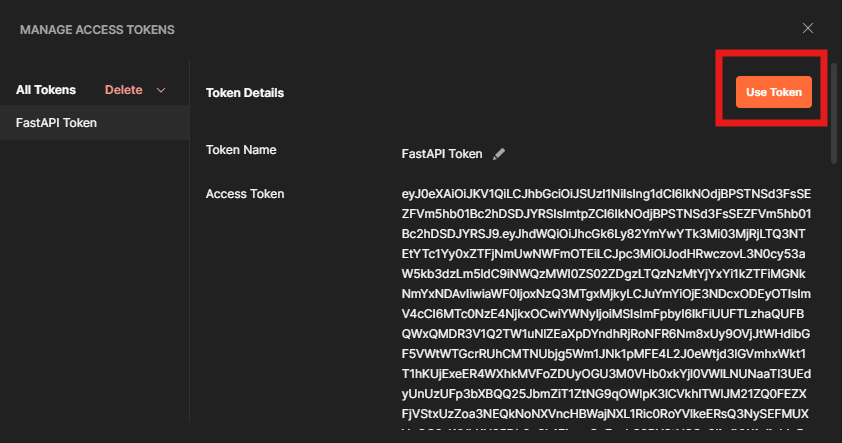

# Building a REST API with Azure AD SSO and FastAPI to Be Consumed via Copilot Studio Agent

## Introduction

This hands-on lab walks you through the process of building a secure Python-based REST API using **FastAPI**, integrated with **Azure Active Directory (Azure AD)** for **Single Sign-On (SSO)** authentication. The API is designed to be consumed by a **Microsoft Copilot Studio Agent**, enabling secure, identity-aware interactions between your backend services and conversational AI experiences.

You’ll learn how to:
- Register and configure Azure AD applications for both the API and the Copilot client
- Implement OAuth2 authentication and token validation in FastAPI
- Secure endpoints and extract user identity from access tokens
- Run and test your API locally using **Visual Studio Code**

By the end of this lab, you’ll have a fully functional, enterprise-ready API that supports delegated access and is ready to integrate with Microsoft Copilot Studio.

---

## Prerequisites

- ✅ Azure Subscription
- ✅ Python 3.10+ 
- ✅ Visual Studio Code
- ✅ VSCode Extensions: Python, Pylance, REST Client (optional)
- ✅ (Optional) Postman for API testing

---

## Azure App Registration Setup

It is necessary to configure two separate app registrations. once for client and another for the server.

- **Client App Registration:** Represents the frontend or the tool that initiates the login flow (e.g., SPA, Postman, Swagger UI).

- **Server App Registration (API):** Represents the backend API that requires access control and validates tokens.

This separation allows:

- Clear permission boundaries
- Better security and token scoping
- Easier management of roles and consent

--- 

### 1. Register the API Application (server)

- Go to [Azure Portal](https://portal.azure.com/) to **Azure Active Directory > App registrations**
- Click **+ New registration**

   
   
- Fill in:
   - **Name**: `PythonFastAPI-SSO-API`
   - **Supported account types**: Single tenant
   - **Redirect URI**: `http://localhost:8000/docs/oauth2-redirect`

- Click **Register**

   

#### Define a Custom Scope

- Go to **Expose an API**
- Click Add for Application ID URI (e.g., api://<client-id>), keep the default value and then click on Save.

   
   
- Click **+ Add a scope**
  - Name: `access_as_user`
  - Admin consent display name: `Access FastAPI`
  - Description: `Allows the app to access FastAPI on behalf of the user`

  

---

### 2. Register the Client Application

1. Go to **App registrations** > **+ New registration**
2. Fill in:
   - **Name**: `PythonFastAPI-SSO-Client`
   - **Redirect URI**: `http://localhost:8000/docs/oauth2-redirect`
3. Click **Register**

#### Configure API Permissions

- Go to **API permissions** > **+ Add a permission**
- Choose **APIs my organization uses**
- Select the **PythonFastAPI-SSO-API**

  
  
- Add the `access_as_user` scope

- Click **Add permissions**

  

- Click **Grant admin consent**
  
  
  
- Go to **Certificates & secrets**

- Click on **+ New client secret**.

- In the dialog that appears:

   - Add a description (e.g., FastAPI Secret)
   - Choose an expiration period (e.g., 6 months, 12 months, or 24 months)
   - Click Add.
   
   

- Once the secret is created, copy the Value immediately — this is your Client Secret, and it will only be shown once.

⚠️ Store this value securely. You’ll need it in your FastAPI app and Postman configuration.

   

- Go to **Authentication**.

- Under the Redirect URIs section, add the following URI:

  https://oauth.pstmn.io/v1/browser-callback

- Click Save to apply the changes.

  

ℹ️ This URI is used by Postman to receive the authorization code after the user signs in. Without it, the OAuth flow will fail.

---

## Local Development Setup

---
### 🧰 1. Install Prerequisites

- ✅ Install Python
  - Download and install Python from https://www.python.org/downloads/windows/
  - During installation, check the box that says “Add Python to PATH”
  
- ✅ Install VSCode Extensions
  - Open VSCode
  - Go to the Extensions tab (Ctrl+Shift+X)
  - Install:
    - Python
    - Pylance
    - REST Client (optional, for testing APIs)

---

### 📁 2. Create Your Project

1. Open a new folder in VSCode (e.g., fastapi-azure-auth)
2. Create a file named main.py
3. Paste the following code into main.py:

```python
from fastapi import FastAPI, Depends, HTTPException
from fastapi.security import OAuth2AuthorizationCodeBearer
from starlette.status import HTTP_401_UNAUTHORIZED
from jose import jwt  # You need to install python-jose
from jose import JWTError
import logging
import requests

logging.basicConfig(level=logging.DEBUG)
logger = logging.getLogger(__name__)

app = FastAPI()

# Azure AD Configuration
TENANT_ID = "your-tenant-id"
CLIENT_ID = "your-client-id"
AUTHORITY = f"https://login.microsoftonline.com/{TENANT_ID}"
JWKS_URL = f"{AUTHORITY}/discovery/v2.0/keys"

oauth2_scheme = OAuth2AuthorizationCodeBearer(
    authorizationUrl=f"{AUTHORITY}/oauth2/v2.0/authorize",
    tokenUrl=f"{AUTHORITY}/oauth2/v2.0/token"
)

def get_public_keys():
    jwks = requests.get(JWKS_URL).json()
    return {key["kid"]: key for key in jwks["keys"]}

def decode_token(token: str):
    try:
        keys = get_public_keys()
        unverified_header = jwt.get_unverified_header(token)
        logger.debug(f"Token header: {unverified_header}")
        key = keys.get(unverified_header["kid"])
        if not key:
            raise HTTPException(status_code=HTTP_401_UNAUTHORIZED, detail="Invalid token header: kid not found")
        # Allow audience with api:// prefix
        payload = jwt.decode(token, key, algorithms=["RS256"], audience=f"api://{CLIENT_ID}")
        logger.debug(f"Decoded payload: {payload}")
        return payload
    except JWTError as e:
        logger.error(f"Token decoding failed: {str(e)}")
        logger.error(f"Expected audience: api://{CLIENT_ID}")
        logger.error(f"Token (partial): {token[:20]}...")
        raise HTTPException(status_code=HTTP_401_UNAUTHORIZED, detail=f"Token decoding failed: {str(e)}")

async def get_current_user(token: str = Depends(oauth2_scheme)):
    try:
        payload = decode_token(token)
        return payload
    except Exception:
        raise HTTPException(status_code=HTTP_401_UNAUTHORIZED, detail="Invalid credentials")

@app.get("/consultar")
async def consultar(protocoloFormatado: str, user_info: dict = Depends(get_current_user)):
    user_email = user_info.get("preferred_username", "unknown")
    return {"message": "0014356-84.2024.8.16.6000", "user_email": user_email}
```

4. Replace the values of the TENANT_ID and CLIENT_ID by the values from the Azure Application registration created by the server API.

   

---

### 📦 3. Set Up a Virtual Environment

Open the terminal in VSCode (Ctrl+`), then run:

```python
python -m venv venv
.\venv\Scripts\activate
```

---

### 📥 4. Install Required Packages

```python
pip install fastapi uvicorn python-jose requests


pip install azure-identity
```

---

### 📝 5. Create requirements.txt

In the terminal:

```python
pip freeze > requirements.txt
```

This helps you or others recreate the environment later.

---

### 🚀 6. Run the API

In the terminal:

```python
uvicorn main:app --reload
```

Your API will be live at: http://127.0.0.1:8000/consultar


---

## 🧪  Test the Endpoint

You can test it using different tools. For simplicity, this lab is using Postman.

---

### 🔐 Step 1: Confirm the API Requires Authentication

1. Open [Postman](https://www.postman.com/).

2. In the top-left corner, click the **+** button to open a new request tab.

   
 
3. Set the **HTTP method** to GET using the dropdown next to the URL field.

4. In the URL field, enter your API endpoint, for example:
   
   ```
   http://localhost:8000/consultar?protocoloFormatado=00123-45.2025.3.36.2000
   ```

5. Click **Send** to run the request.

6. You should receive a **401 Unauthorized** response. This confirms that your API is protected and requires authentication via Azure AD.

    ```json
    {
      "detail": "Not authenticated"
    }
    ```
   

---


Step 2: Authenticate with Azure AD (OAuth 2.0)

1. Go to the Authorization tab in Postman.

2. Set Type to OAuth 2.0.

   

3. Scroll down to find the **Configure New Token** session and fill in the following fields:

   - Token Name: FastAPI Token
   - Grant Type: Authorization Code
   
   - Auth URL: https://login.microsoftonline.com/<TENANT_ID>/oauth2/v2.0/authorize
   - Access Token URL: 	https://login.microsoftonline.com/<TENANT_ID>/oauth2/v2.0/token
   - Client ID: <CLIENT_ID of Client App>
   - Client Secret: <CLIENT_SECRET>
   - Scope: api://<SERVER_APP_CLIENT_ID>/access_as_user


  Replace the values of the TENANT_ID, CLIENT_ID and CLIENT_SECRET by the values from the Azure Application registration created by the client APP.

  

4. Scroll down all to the bottom of the Authorization tab and click **Get New Access Token**.

   
   
5. You will be redirected to the Microsoft sign-in page.
   Sign in using a valid Azure AD user account that has permission to access the API.
   
   
   
6. After successful login, Postman will retrieve an access token.
   Click Use Token to attach it to your request.
   
   
   

7. Now that the access token is attached to your request, click Send again to run the request — this time with the token included.

   You should now receive a 200 OK response from the API, confirming that authentication was successful.

   Example response:

    ```json
    {
      "message": "0014356-84.2024.8.16.6000",
      "user_email": "your.name@yourdomain.com"
    }
    ```

   
   
✅ This confirms that your Azure AD SSO integration is working and your API is securely protected.