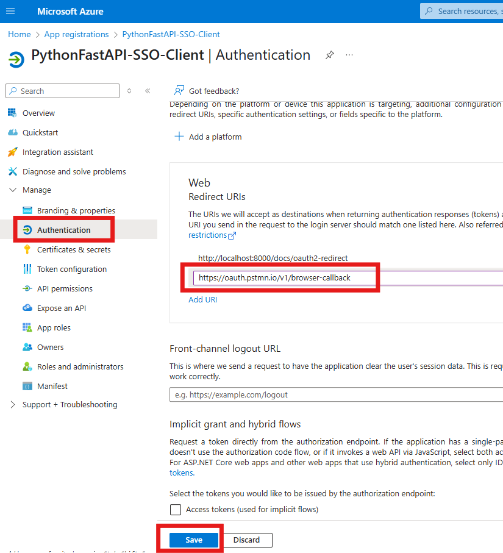
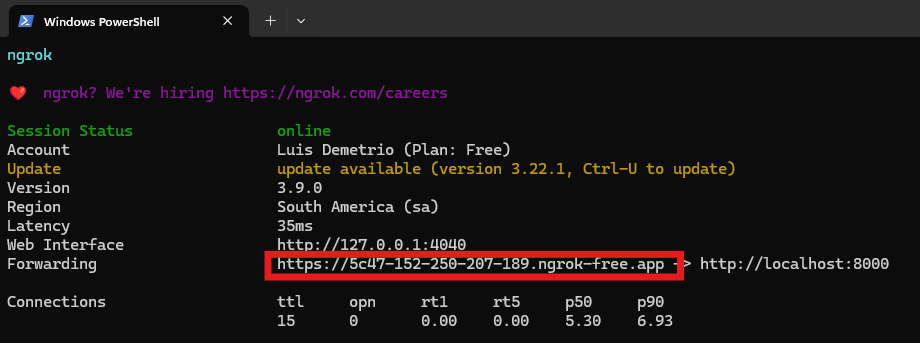

# Building a REST API with Azure AD SSO and FastAPI to Be Consumed via Copilot Studio Agent

## Table of Contents

1. Introduction
2. Prerequisites
3. Lab Structure
4. 🧩 Part 1: Azure App Registration Setup
    - Step 1: Register the API Application (Server)
    - Step 2: Register the Client Application
5. 🧩 Part 2: Local Development Setup
    - Step 1: Install Prerequisites
    - Step 2: Create Your Project
    - Step 3: Set Up a Virtual Environment
    - Step 4: Install Required Packages
    - Step 5: Create requirements.txt
    - Step 6: Run the API
6. 🧩 Part 3: Testing and Validation
    - Step 1: Confirm the API Requires Authentication
    - Step 2: Authenticate with Azure AD (OAuth 2.0)
7. Next Steps
8. Additional Resources

---

## Introduction

This hands-on lab walks you through building a secure Python-based REST **API** using FastAPI, integrated with **Azure Active Directory (Azure AD)** for **Single Sign-On (SSO)** authentication. The API is designed to be consumed by a **Microsoft Copilot Studio Agent**, enabling secure, identity-aware interactions between your backend services and conversational AI experiences.

You’ll learn how to:
- Register and configure Azure AD applications for both the API and the Copilot client
- Implement OAuth2 authentication and token validation in FastAPI
- Secure endpoints and extract user identity from access tokens
- Run and test your API locally using Visual Studio Code

By the end of this lab, you’ll have a fully functional, enterprise-ready API that supports delegated access and is ready to integrate with Microsoft Copilot Studio.

---

## Prerequisites

- ✅ Azure Subscription
- ✅ Python 3.10+ 
- ✅ Visual Studio Code
- ✅ VSCode Extensions: Python, Pylance, REST Client (optional)
- ✅ (Optional) Postman for API testing

---

## Lab Structure

This lab is divided into three main parts:

- 🧩 Part 1: Azure App Registration Setup
- 🧩 Part 2: Local Development Setup
- 🧩 Part 3: Testing and Validation
    
Each part contains step-by-step instructions and visual callouts for important notes, warnings, and tips.

---


## 🧩 Part 1: Azure App Registration Setup

>ℹ️ Note:
>
>You will configure two separate app registrations: one for the client (Copilot/consumer) and one for the server (API).

### Why Two App Registrations?

   - Client App Registration: Represents the frontend or tool that initiates the login flow (e.g., Copilot, Postman, Swagger UI).
   - Server App Registration (API): Represents the backend API that requires access control and validates tokens.

### Benefits:

   - Clear permission boundaries
   - Better security and token scoping
   - Easier management of roles and consent

--- 

### 🧱 Step 1. Register the API Application (server)

   1. Go to [Azure Portal](https://portal.azure.com/) to **Azure Active Directory > App registrations**
   2. Click **+ New registration**

      
   
   3. Fill in:
      - **Name**: `PythonFastAPI-SSO-API`
      - **Supported account types**: Single tenant
      - **Redirect URI**: `http://localhost:8000/docs/oauth2-redirect`
    
   4. Click **Register**
    
      

   5. Define a Custom Scope

      - Go to **Expose an API**
      - Click Add for Application ID URI (e.g., api://<client-id>), keep the default value and then click on Save.

        
   
      - Click **+ Add a scope**
        - Name: `access_as_user`
        - Admin consent display name: `Access FastAPI`
        - Description: `Allows the app to access FastAPI on behalf of the user`

        

---

### 🧱 Step 2. Register the Client Application

   1. Go to **App registrations** > **+ New registration**
   2. Fill in:
      - **Name**: `PythonFastAPI-SSO-Client`
      - **Redirect URI**: `http://localhost:8000/docs/oauth2-redirect`
   3. Click **Register**

   4. **Configure API Permissions:**

      - Go to **API permissions** > **+ Add a permission**
      - Choose **APIs my organization uses**
      - Select the **PythonFastAPI-SSO-API**

        
  
      - Add the `access_as_user` scope

      - Click **Add permissions**

        

      - Click **Grant admin consent**
  
        
   
   5. **Create a Client Secret:**
      
      - Go to **Certificates & secrets**

      - Click on **+ New client secret**.

      - In the dialog that appears:

        - Add a description (e.g., FastAPI Secret)
        - Choose an expiration period (e.g., 6 months, 12 months, or 24 months)
        - Click Add.
       
        

        - Once the secret is created, copy the Value immediately — this is your Client Secret, and it will only be shown once.
        
        >⚠️ Warning:
        >
        >Store this value securely. You’ll need it in your FastAPI app and Postman configuration.
        
        
        
   6. **Add Postman Redirect URI:**

        - Go to **Authentication**.

        - Under the Redirect URIs section, add the following URI:

        `https://oauth.pstmn.io/v1/browser-callback`

        - Click Save to apply the changes.

          

        >ℹ Info:
        >
        > This URI is used by Postman to receive the authorization code after the user signs in. Without it, the OAuth flow will fail.

---

## 🧩 Part 2: Local Development Setup

---
### 🧱 Step  1. Install Prerequisites

1. ✅ Install Python
   - Download from [phyton.org](!https://www.python.org/downloads/windows/).
   - Add Python to PATH during installation.
  
2. ✅ Install VSCode Extensions
   - Open VSCode
   - Go to the Extensions tab (Ctrl+Shift+X)
   - Install:
     - Python
     - Pylance
     - REST Client (optional, for testing APIs)

---

### 🧱 Step 2. Create Your Project

1. Open a new folder in VSCode (e.g., fastapi-azure-auth)
2. Create a file named main.py
3. Paste the provided FastAPI code (see below):

    ```python
    from fastapi import FastAPI, Depends, HTTPException
    from fastapi.security import OAuth2AuthorizationCodeBearer
    from starlette.status import HTTP_401_UNAUTHORIZED
    from jose import jwt  # You need to install python-jose
    from jose import JWTError
    from fastapi.responses import FileResponse
    import logging
    import requests
    import fitz

    logging.basicConfig(level=logging.DEBUG)
    logger = logging.getLogger(__name__)

    app = FastAPI()

    # Azure AD Configuration
    TENANT_ID = "your-tenant-id"
    CLIENT_ID = "your-client-id"
    AUTHORITY = f"https://login.microsoftonline.com/{TENANT_ID}"
    JWKS_URL = f"{AUTHORITY}/discovery/v2.0/keys"

    oauth2_scheme = OAuth2AuthorizationCodeBearer(
        authorizationUrl=f"{AUTHORITY}/oauth2/v2.0/authorize",
        tokenUrl=f"{AUTHORITY}/oauth2/v2.0/token"
    )
    
    def get_public_keys():
        try:
            response = requests.get(JWKS_URL)
            response.raise_for_status()
            jwks = response.json()
            return {key["kid"]: key for key in jwks["keys"]}
        except requests.RequestException as e:
            logger.error(f"Failed to fetch JWKS: {str(e)}")
            raise HTTPException(status_code=500, detail=f"Failed to fetch JWKS: {str(e)}")
    
    def decode_token(token: str):
        try:
            keys = get_public_keys()
            unverified_header = jwt.get_unverified_header(token)
            logger.debug(f"Token header: {unverified_header}")
            key = keys.get(unverified_header["kid"])
            if not key:
                raise HTTPException(status_code=HTTP_401_UNAUTHORIZED, detail="Invalid token header: kid not found")
            # Allow audience with api:// prefix
            payload = jwt.decode(token, key, algorithms=["RS256"], audience=f"api://{CLIENT_ID}")
            logger.debug(f"Decoded payload: {payload}")
            return payload
        except JWTError as e:
            logger.error(f"Token decoding failed: {str(e)}")
            logger.error(f"Expected audience: api://{CLIENT_ID}")
            logger.error(f"Token (partial): {token[:20]}...")
            raise HTTPException(status_code=HTTP_401_UNAUTHORIZED, detail=f"Token decoding failed: {str(e)}")
    
    
    async def get_current_user(token: str = Depends(oauth2_scheme)):
        logger.debug(f"Received token: {token[:10]}...")
        try:
            payload = decode_token(token)
            return payload
        except Exception as e:
            logger.error(f"Token validation failed: {str(e)}")
            raise HTTPException(status_code=HTTP_401_UNAUTHORIZED, detail="Invalid credentials")
    
    @app.get("/getprocessnumber")
    async def consultar(protocol: str, user_info: dict = Depends(get_current_user)):
        user_email = user_info.get("upn", "unknown")
        return {"message": "0014356-84.2024.8.16.6000", "user_email": user_email}
    
    
    
    @app.get("/getprocessdetails")
    async def get_pdf_text(user_info: dict = Depends(get_current_user)):
        pdf_path = "pdfs/processo.pdf"
        try:
            doc = fitz.open(pdf_path)
            text = ""
            for page in doc:
                text += page.get_text()
            return {"text": text}        
        except Exception as e:
            raise HTTPException(status_code=500, detail=f"Error to read the PDF: {str(e)}")
    
    ```

4. Replace the values of the TENANT_ID and CLIENT_ID by the values from the Azure Application registration created by the server API.

   

---

### 🧱 Step 3. Set Up a Virtual Environment

   1. Open the terminal in VSCode (Ctrl+`), then run:

        ```python
        python -m venv venv
        .\venv\Scripts\activate
        ```
        
        ---

### 🧱 Step 4. Install Required Packages

   1. Open the terminal in VSCode (Ctrl+`), then run:
    
        ```python
        pip install fastapi uvicorn python-jose requests
        
        
        pip install azure-identity
        ```

---

### 🧱 Step 5. Create requirements.txt

  1. Open the terminal in VSCode (Ctrl+`), then run:

        ```python
        pip freeze > requirements.txt
        ```

  2. This helps you or others recreate the environment later.

---

### 🧱 Step 6. Run the API

  1. Open the terminal in VSCode (Ctrl+`), then run:

        ```python
        uvicorn main:app --reload
        ```

  2. Your API will be live at: http://127.0.0.1:8000/consultar


     

---

## 🧩 Part 3: Testing and Validation


### 🧱 Step 1. Expose Your Local API to the Internet with ngrok

  >ℹ️ Why ngrok?
  >
  >Microsoft Copilot Studio (and other cloud services) cannot access your API running on localhost. You need to expose your local server to the internet using a secure tunnel. ngrok is a popular tool for this purpose.

  1. **Install ngrok:**
  
     - Go to ngrok.com and download the version for your operating system.
     - Unzip and place the executable somewhere in your PATH.
     - (Optional) Sign up for a free ngrok account to get an auth token and higher limits.
     
  2. **Start ngrok Tunnel:**
     - In your terminal (with your FastAPI server running), start ngrok to forward HTTP traffic to your local API port (usually 8000):

       `ngrok http 8000`

     - You’ll see output similar to:
     
       ```
       Forwarding    https://abcd1234.ngrok.io -> http://localhost:8000
       ```

     - Copy the HTTPS URL (e.g., https://abcd1234.ngrok.io). This is your public endpoint.
     
       
     
3. *Update Redirect URIs and API URLs:**

   - In your Azure App Registrations (both Client and API), add your ngrok HTTPS URL as an additional Redirect URI if you plan to use OAuth flows through this endpoint.
   - In Copilot Studio or any external client, use the ngrok HTTPS URL as the API base URL (e.g., https://abcd1234.ngrok.io/getprocessnumber).
   
   >⚠️ Warning:
   >
   >ngrok URLs change every time you restart the tunnel (unless you have an account plan with reserved domains). Update your configurations accordingly each time.
   
4. **Test External Access:**

   - Open your ngrok HTTPS URL in a browser or use Postman to confirm your API is accessible from the internet.
     
     
   
   - Click ob Visit to be redirect to the Open AI specification file (Swagger):
   
     
   
   - Now, Copilot Studio or any cloud-based client can securely call your FastAPI endpoints.
   
---

### 🧱 Step  2: Confirm the API Requires Authentication

1. Open [Postman](https://www.postman.com/).

2. **Create a new GET request:**

   - In the top-left corner, click the **+** button to open a new request tab.

     
 
   - Set the **HTTP method** to GET using the dropdown next to the URL field.

   - In the URL field, enter your API endpoint, for example:
   
     ```
     https://5c47-152-250-207-189.ngrok-free.app/getprocessnumber?protocol=123456
     ```

3. Click **Send** to run the request.

   - You should receive a **401 Unauthorized** response.

     ```json
     {
       "detail": "Not authenticated"
     }
     ```
     
     

---


### 🧱 Step 3: Authenticate with Azure AD (OAuth 2.0)

1. Go to the Authorization tab in Postman.

2. Set Type to OAuth 2.0.

   

3. Under **Configure New Token**, fill in:

   - Token Name: FastAPI Token
   - Grant Type: Authorization Code
   - Auth URL: https://login.microsoftonline.com/<TENANT_ID>/oauth2/v2.0/authorize
   - Access Token URL: 	https://login.microsoftonline.com/<TENANT_ID>/oauth2/v2.0/token
   - Client ID: <CLIENT_ID of Client App>
   - Client Secret: <CLIENT_SECRET>
   - Scope: api://<SERVER_APP_CLIENT_ID>/access_as_user


   - ️Replace the values of the TENANT_ID, CLIENT_ID and CLIENT_SECRET by the values from the Azure Application registration created by the client APP.

     

4. Click **Get New Access Token**.

   
   
5. You will be redirected to the Microsoft sign-in page.
   Sign in using a valid Azure AD user account that has permission to access the API.
   
   
   
6. After successful login, Postman will retrieve an access token.
   Click Use Token to attach it to your request.
   
   
   

7. Click **Send** again to run the request.

   - You should now receive a 200 OK response:

   
     ```json
     {
       "message": "0014356-12.2025.5.28.2000",
       "user_email": "your.name@yourdomain.com"
     }
     ```

  - This confirms that your Azure AD SSO integration is working and your API is securely protected.
   
    
   
